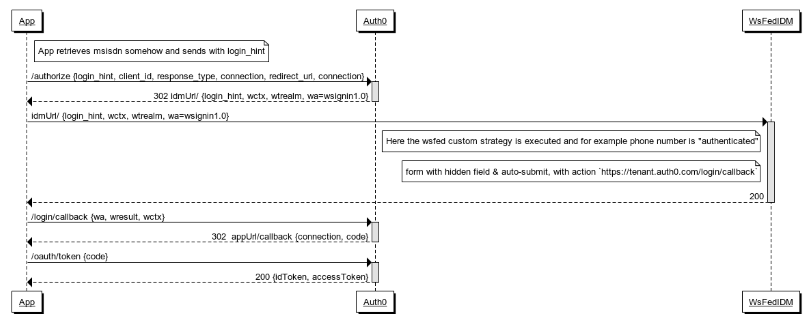

## What is this?

Illustrates how it is possible to write a custom authentication strategy (here, using passport-custom NPM module & checking for a matching phone number). Uses wsfed NPM module to leverage wsfed signin protocol and SAML1.1 for the Token Type (Response Assertion).

In Auth0, setup an ADFS Connection.

Screenshot example:


Next, create a Client in Auth0 Dashboard and associate with your new ADFS Connection. We are using the ADFS connection for WSFed signin protocol, and SAML1.1 Response Assertion (token type).

### Setup

Clone the repo, and from root:

```
yarn install
```

Rename env.sample to .env and update props:

```
AUTH0_DOMAIN={{TENANT_NAME}}.auth0.com
ISSUER_NAME={{ANYTHING_YOU_WANT}}
WTREALM=urn:auth0:{{TENANT_NAME}}
```

You can use `node generateKey` to generate a `signingKey.json` file.

Finally:

```
npm start
```

### How does it work

Here is a sequence diagram of how you might use this for example from an Auth0 Client using OIDC / Oauth2



The interesting part here is that your application can happily talk OIDC / Oauth2 with Auth0, and via browser rediection, Auth0 can talk WSFED / SAML1.1 with this Custom WsFed IDM component using whatever authentication strategy you choose as the decision logic for "being successfully authenticated."

WSFED is actually pretty straightforward, but rather like SAML too, compared to Oauth2 it requires more hands-on practice to become familiar, and isn't quite as easy
to just grok partly because good documentation and tutorials are less easy to come by.

For a very simple introduction on key concepts if in need of a refresh, recommend [this blog]( https://blogs.technet.microsoft.com/askpfeplat/2014/11/02/adfs-deep-dive-comparing-ws-fed-saml-and-oauth/)

Here is a quick recap of the primary "params" you'll see using this sample.

- Wa=signin1.0: This tells the ADFS server to invoke a login for the user.
- Wtrealm: This tells ADFS what application I was trying to get to. This has to match the identifier of one of the relying party trusts listed in ADFS.
- Wctx: This is some session data that the application wants sent back to it after the user authenticates.
- Wresult: Contains the actual SAML Response Assertion

When the WS-Fed sign-in protocol is used, ADFS will always issue a SAML 1.1 token back to your browser, which you then automatically POST back to the application.

As an illustration of how this might be called from say a Pug Template using Node.js:

```
extends layout

block content
  .w3-container
    if loggedIn
      h4 You are logged in!
    else
      h4 You are not logged in! Please #[a(href="https://quickstart-playground.auth0.com/authorize?login_hint=123&scope=openid profile&response_type=code&connection=myADFSConnection&sso=true&protocol=oauth2&audience=https://quickstart-playground.auth0.com/userinfo&state=XOn389yLQOCM71qA2eIXCHBfNtg4OwRB&client_id=VSvHz93bynrwSq8pnx25x3JiftJ2Quc4&redirect_uri=http://localhost:3000/callback") Log In] to continue.
```

Above,`login_hint` is the query param we send to represent the phone number (msisdn) to be checked by the IDM. For the example, we simply accept `123` and reject any other value.

### How to modify the Password Custom Strategy and associated WSFed Claims etc..

Should be easy enough to see how you could change the Custom Strategy to something else.

The base project is just composed by running the express generator - `express auth0-wsfed-idm`, then the static public directory and views were removed.Finally, the error handling in app.js was altered to use res.json instead of res.render() since there is no view layer. All the wsfed logic is really a configuration / wrapper onto the `wsfed` NPM module. Most of the wsfed specific logic lives inside `wsfedOptions.js`,`profileMapper.js` and `routes/index.js`.

- Alter the `msisdnStrategy` middleware,
- Alter the profileMapper to be the claims your strategy requires
- Check app.js, and routes/index.js to ensure your strategy cleanly replaces any msisdn related references.

### Ngrok

```
npm install ngrok -g
```

`runNgrok.sh` is a convenience for exposing your locally running app to the Internet so that Auth0 can reach it.


### Honours

This sample is a shameless rewrite of a similar sample written by Abhishek, and the Certificate Generation script was "borrowed" from Justin. Thanks guys.
